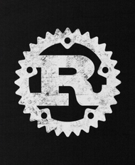

# Introduction

Ce livre est une introduction au langage de programmation Rust, destiné aux débutants en programmation. Il est divisé en 3 partie:

* [le langage de programmation Rust](2-why.md) ;
* [l'utilisation du langage](7-system.md) ;
* [un didacticiel pratique](16-create.md).

La première partie vous expliquera ce qu'est Rust, ses différences avec d'autres langages ainsi qu'un aperçu général autour de ses fonctionnalités. La deuxième partie vous donnera un avant-goût de son utilisation à travers différents domaines de la programmation ainsi que des exemples de cette utilisation. Le dernier chapitre vous montrera comment construire une "Todo" app en ligne de commande en vous expliquant chaque étape

Vous pourrez aussi trouver à la fin de ce livre quelques ressources additionnelles vous permettant d'approfondir le sujet et découvrir Rust.

J'ai écris ce livre pour m'essayer à la crate [mdBook](https://github.com/rust-lang/mdBook) et d'approfondir mes connaissances concernant Rust ainsi que des concepts de programmation plus globaux, il s'agit d'un projet personnel qui, je l'espère, vous permettra de mieux comprendre Rust.

Mais je reste un débutant dans le domaine, je n'ai actuellement que peu de connaissances au niveau de Rust et de la programmation en générale, je me suis lancé dans une reconversion professionnelle et je voulais partager un peu de ce que j'ai pu apprendre depuis.

