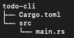

# Commencer avec Rust

D'abord, téléchargez Rust sur votre ordinateur.

Pour les systèmes Unix comme Linux et MacOS, vous devez simplement ouvrir un terminal et écrire ceci:

`$ curl https://sh.rustup.rs -sSf | sh`

Si tout va bien, vous devriez voir ceci apparaitre dans votre terminal

`Rust is installed now. Great!`

Du coté de Windows, téléchargez et lancez [rustup-init.exe](https://win.rustup.rs). Cela va démarrer l'installation dans une console et vous devriez voir le message précédent si l'opération est un succès.

Pour d'autres options d'installation et informations, vous pouvez vous rendre sur la page [getting started](https://www.rust-lang.org/learn/get-started) du site officiel de Rust. Là, vous trouverez également les instructions pour intégrer le langage à votre éditeur favori pour une meilleure expérience.

## Débuter un projet

Pour commencer un nouveau projet, allez à l'endroit où vous voulez créer votre projet (comme un dossier `/repos` par exemple) et lancez simplement `cargo new <project-name>`. Dans mon cas, j'ai gardé le nom du tutoriel de base et utilisé "todo-cli". J'ai donc lancé:

`$ cargo new todo-cli`

Maitenant, naviguez vers le dossier fraichement créé et listez son contenu. Vous devriez voir deux fichier à l'intérieur du dossier



Nous allons travailler sur le fichier `src/main.rs` pour le reste de ce livre, donc allons-y et ouvrons-le:

```rust
fn main(){
    println!("Hello world!");
}
```

Comme beaucoup d'autres langages, Rust a une fonction main qui sera lancée en premier. `fn` est la mot-clé permettant de déclarer une fonction, tandis que le `!` dans `println!` représente une [macro](https://doc.rust-lang.org/book/ch19-06-macros.html). Comme vous l'avez peut être deviné, ce programme est la version Rust de "[hello world!](https://en.wikipedia.org/wiki/%22Hello,_World!%22_program)".


Pour le builder et le lancer, exécutez simplement `cargo run`.

```
$ cargo run
Hello world!
```

> *Note:* Vous pouvez voir un bouton "play" en haut à droite de l'encart contenant le code Rust `Hello world!`, il vous permet de tester le code directement sur cette page, c'est comme si vous lanciez `cargo run` depuis votre terminal.

## Comment lire les arguments

Notre but est d'avoir un [CLI](./content/13-cli.md) qui accepte deux arguments: le premier sera l'action, et le second sera l'item.

Nous allons commencer par lire les arguments saisis par l'utilisateur et les afficher. Remplacez le contenu de `main` avec ce qui suit:

```rust, ignore
fn main() {
    let action = std::env::args().nth(1).expect("Please specify an action");
    let item = std::env::args().nth(2).expect("Please specify an item");

    println!("{:?}, {:?})", action, item);
}
```

Commençons par digérer toutes ses informations, prenons cette ligne:

`let action = std::env::args().nth(1).expect("Please specify an action")`

Nous allons la décomposer pour voir ce qu'il se passe

[`let action =`](https://doc.rust-lang.org/std/keyword.let.html)

le mot clé `let` lie une valeur à une variable (qui sera ici action).

[`std::env::args()`](https://doc.rust-lang.org/std/env/fn.args.html)

C'est une fonction du module *env* de la [bibliothèque standard de Rust](https://doc.rust-lang.org/std/) qui retourne l'argument avec lequel le programme a commencé.

[`.nth(1)`](https://doc.rust-lang.org/std/iter/trait.Iterator.html#method.nth)

Comme l'argument retourné par la fonction précédente est un itérateur, nous pouvons accéder à la valeur stockée à chaque position avec la méthode `nth()`. L'argument a la position 0 étant le programme lui-même, on commence à lire au premier élément.

[`.expect("Please specify an action")`](https://doc.rust-lang.org/std/option/enum.Option.html#method.expect)

C'est une méthode définie pour l'[enum](https://doc.rust-lang.org/stable/std/keyword.enum.html) [`Option`](https://doc.rust-lang.org/std/option/enum.Option.html) qui pourra être la valeur, mais si elle n'est pas présente, le programme se terminera directement (on dis qu'il "panic" dans les termes Rust), retournant le message fourni qui sera ici "Please specify an action".

Comme le programme peut être lancé sans argument, Rust nous demande de vérifier si une valeur est réellement fournie en nous donnant un type Option: soit la valeur est là, soit non.

En tant que programmeur, nous avons la responsabilité d'assurer que nous prenons l'action appropriée dans chaque cas. Pour le moment, si l'argument n'est pas fourni nous allons quitter le programme directement

Lançons le programme et passons lui deux arguments. Pour faire cela, ajoutez-lez après `--`. Par exemple:

```
$ cargo run -- hello world!
    Finished dev [unoptimized + debuginfo] target(s) in 0.01s
     Running `target/debug/todo_cli hello 'world'\!''``
"hello", "world!"
```
